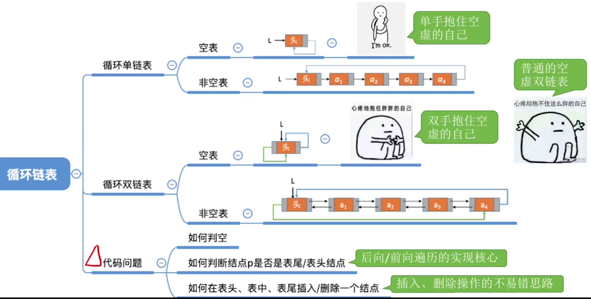
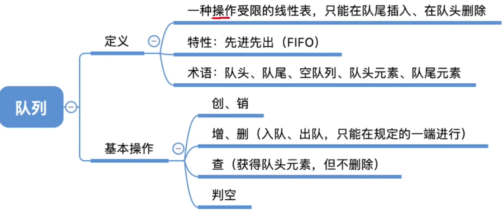
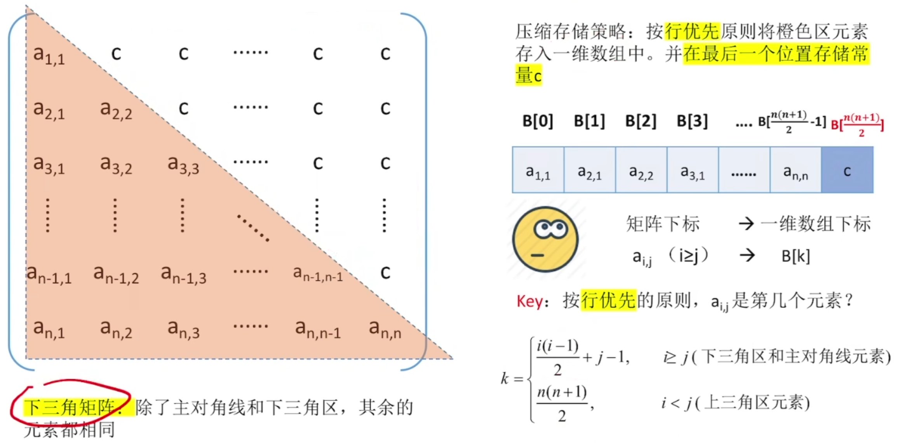
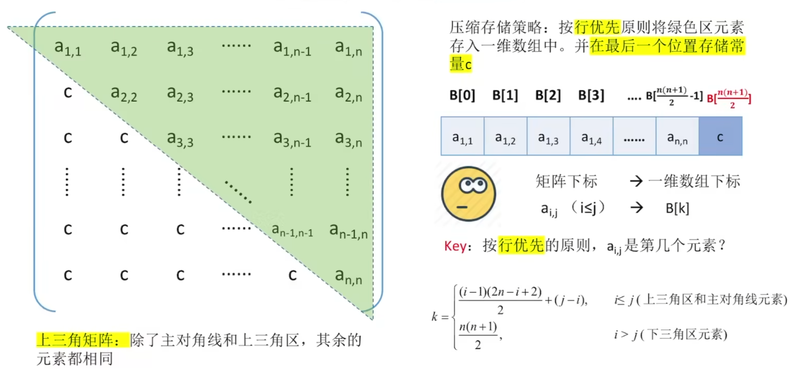
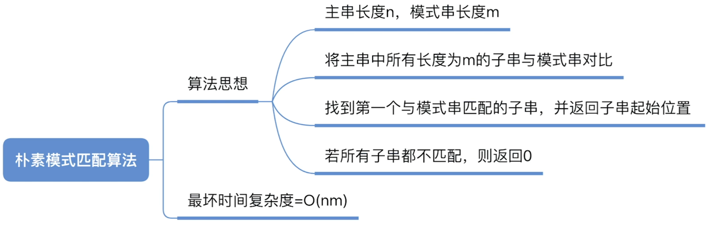

# 一、绪论

## 1.数据结构的基本概念

### 1.1 概念

**数据**：数据是**信息的载体**，是描述客观事物属性的数、字符及所有能输入到计算机中并**被计算机程序识别和处理的**符号的集合。数据是计算机程序加工的原料。

**数据元素、数据项**：数据元素是数据的基本单位，通常作为一个整体进行考虑和处理，一个数据元素可由若干个数据项组成，数据项是构成数据元素的不可分割的最小单位。

**数据对象**：具有**相同性质**的数据元素的集合，是数据的一个子集。

**数据结构**：是相互之间存在一种或多种特定**关系**的数据元素的集合。


### 1.2 数据结构的三要素

#### 1.2.1 逻辑结构：

- **集合结构**：各个元素同属一个集合，别无其他关系。


- **线性结构**：数据元素之间是一对一的关系。除了第一个元素，所有元素都有唯一前驱；除了最后一个元素，所有元素都有唯一后继。


- **树形结构**：数据元素之间是一对多的关系。


- **图状结构**：数据元素之间是多对多的关系。

  

#### 1.2.2 数据的运算

结合逻辑结构、实际需求来定义基本运算。

**基本运算：**

1. 查找第i个数据元素
2. 在第i个位置插入新的数据元素
3. 删除第i个位置的数据元素


#### 1.2.3 物理结构（存储结构）

如何用计算机表示数据元素的逻辑关系？

**数据的存储结构**：

- **顺序存储**：把逻辑上相邻的元素存储在物理位置上也相邻的存储单元中，元素之间的关系由存储单元的邻接关系来体现。

- **链式存储**：逻辑上相邻的元素在物理位置上可以不相邻，借助指示元素存储地址的**指针**来表示元素之间的逻辑关系。
- **索引存储**：在存储元素信息的同时，还建立附加的索引表。索引表中的每项称为索引项，索引项的一般形式是（关键字，地址）。
- **散列存储**：根据元素的关键字直接计算出该元素的存储地址，又称哈希(Hash)存储。

**总结：**

1.若采用顺序存储，则各个数据元素在物理上必须是连续的；若采用非顺序存储，则各个数据元素在物理上可以是离散的。

2.数据的存储结构会影响存储空间分配的方便程度

3.数据的存储结构会影响对数据运算的速度


#### 1.2.4 补充

**数据类型、抽象数据类型**


### 1.3 知识点回顾


## 2.什么是算法

程序=数据结构+算法

### 2.1 算法的特性

- **有穷性**：一个算法必须总在执行有穷步之后结束，且每一步都可以在有穷时间内完成。
- **确定性**：算法中每条指令必须有确切的含义，对于相同的输入只能得出相同的输出。
- **可行性**：算法中描述的操作都可以通过已经实现的基本运算执行有限次来实现。
- **输入**：一个算法有零个或多个输入，这些输入取自于某个特定的对象的集合。
- **输出**：一个算法有一个或多个输出，这些输出是与输入有着某种特定关系的量。

### 2.2 “好”算法的特质

1. **正确性**：算法应能正确地解决求解问题。
2. **可读性**：算法应该具有良好的可读性，以帮助人们理解。
3. **健壮性**：输入非法数据时，算法能适当地做出反应或进行处理，而不会产生莫名其妙地输出结果。
4. **高效率与低存储需求**：时间复杂度低，空间复杂度低。

### 2.3 知识点回顾


## 3.算法的时间复杂度

事前预估算法**时间开销T(n)**与**问题规模n**的关系


**记忆：常对幂指阶**


## 4.算法的空间复杂度


# 二、线性表

## 1.定义

线性表是具有**相同**数据类型的n(n≥0)个数据元素的**有限序列**，其中n为**表长**，当n=0时线性表是一个空表。若用L命名线性表，则其一般表示为L=(a1,a2,…,ai,ai+1,…,an)

**位序**是从1开始的，**数组下标**是从0开始的


## 2.基本操作


## 3.知识点回顾


## 4.顺序表

### 4.1 顺序表的定义

**顺序表**——用**顺序存储**的方式实现线性表

**顺序存储**：把逻辑上相邻的元素存储在物理位置上也相邻的存储单元中，元素之间的关系由存储单元的邻接关系来体现。

**优点**：可随机存取，存储密度高。

**缺点**：要求大片连续空间，改变容量不方便


###  4.2 顺序表实现（静态分配）

```c++
#include<stdio.h>

#define MaxSize 10	//定义最大长度

typedef int ElemType;  
    
typedef struct{	//定义单链表节点类型
	ElemType data[MaxSize];	//数据域
	int length;		//顺序表当前的长度
}SqList;	//顺序表的类型定义


//初始化一个顺序表
void InitList(SqList &L){
	for(int i=0;i<MaxSize;i++){
		L.data[i] = 0;	//将所有元素设置默认初始值
	}
	L.length = 0;	//顺序表初始长度为0；
}


int main(){
	SqList L;	//声明一个顺序表
	InitList(L);	//初始化一个顺序表
	return 0;
}
```


### 4.3 顺序表实现（动态分配）

```c
#include<stdio.h>
#include<stdlib.h>

#define InitSize 10	//默认最大长度

typedef int ElemType;  

typedef struct{	//定义单链表节点类型
	ElemType *data;	//指示动态分配的指针
	int MaxSize;	//顺序表的最大容量
	int length;		//顺序表当前的长度
}SeqList;	//顺序表的类型定义


//初始化一个顺序表
void InitList(SeqList &L){
	//用malloc函数申请一片连续的空间
	L.data=(ElemType *)malloc(InitSize*sizeof(ElemType));
	L.length = 0;	//顺序表初始长度为0；
	L.MaxSize=InitSize;
}


//增加动态数组的长度
void IncreaseSize(SeqList &L,int len){
	ElemType *p=L.data;
	L.data=(ElemType *)malloc((L.MaxSize+len)*sizeof(ElemType));
	for(int i=0;i<L.length;i++){
		L.data[i]=p[i];		//将数据复制到新区域
	}
	L.MaxSize=L.MaxSize+len;	//顺序表最大长度增加len
	free(p);	//释放原来的内存空间
}


int main(){
	SeqList L;	//声明一个顺序表
	InitList(L);	//初始化一个顺序表

	//....往顺序表中随便插入几个元素...
	IncreaseSize(L,5);
	return 0;
}
```


### 4.4 顺序表的特点

1. **随机访问**：即可以在O(1)时间内找到第i个元素。
2. **存储密度高**：每个节点只存储数据元素
3. **拓展容量不方便**（即便采用动态分配的方式实现，拓展长度的时间复杂度也比较高）
4. **插入、删除操作不方便**，需要移动大量元素。


### 4.5 知识点回顾


### 4.6 顺序表的插入删除

**插入**:

```c
#include<stdio.h>

#define MaxSize 10	//定义最大长度

typedef int ElemType;  

typedef struct{	//定义单链表节点类型
	ElemType data[MaxSize];	//数据域
	int length;		//顺序表当前的长度
}SqList;	//顺序表的类型定义


//初始化一个顺序表
void InitList(SqList &L){
	for(int i=0;i<MaxSize;i++){
		L.data[i] = 0;	//将所有元素设置默认初始值
	}
	L.length = 0;	//顺序表初始长度为0；
}

bool ListInsert(SqList &L,int i,ElemType e){
	if(i<1 || i>L.length+1)	//判断i的范围是否有效
		return false;
	if(L.length>=MaxSize)	//当前存储空间已满，不能插入
		return false;
	for(int j=L.length;j>=i;j--)	//将第i个元素及之后的元素后移
		L.data[j]=L.data[j-1];
	L.data[i-1]=e;		//在位置i处放入e
	L.length++;		//长度加1
	return true;
}

int main(){
	SqList L;	//声明一个顺序表
	InitList(L);	//初始化一个顺序表
	//...此处省略一些代码，插入几个元素
	ListInsert(L,3,3);
	return 0;
}
```


**删除**：

```c
bool ListDelete(SqList &L,int i,ElemType &e){
	if(i<1 || i>L.length)	//判断i的范围是否有效
		return false;
	e=L.data[i-1];		//将被删除的元素赋给e
	for(int j=i;j<L.length;j++)		//将第i个位置后的元素前移
		L.data[j-1]=L.data[j];
	L.length--;
	return true;
}

int main(){
	SqList L;	//声明一个顺序表
	InitList(L);	//初始化一个顺序表
	//...此处省略一些代码，插入几个元素
	ElemType e=-1;		//获取被删除的元素
	if(ListDelete(L,3,e))
		printf("已删除第3个元素，删除元素值为=%d\n",e);
	else
		printf("位序i不合法，删除失败\n");
	return 0;
}
```


### 4.7 知识点回顾


### 4.8  顺序表的查找

#### 4.8.1 按位查找

获取表L中第i个位置的元素的值，动态分配也可以用这个代码

```c
int GetElem(SqList L,int i){	//获取第i个位置元素的值
	return L.data[i-1];
}
```


#### 4.8.2 按值查找

在表L中查找具有给定关键字值的元素

```c
//在顺序表L中查找第一个元素值等于e的元素，并返回其位序
int LocateElem(SqList L,ElemType e){
	for(int i=0;i<L.length;i++)
		if(L.data[i]==e)
			return i+1;		//数组下标为i的元素等于e，并返回其位序i+1
	return 0;	//退出循环，说明查找失败
}
```


**比较两个结构体**


### 4.9 知识点回顾


## 5.单链表

**优点**：不要求大片连续空间。改变容量方便。

**缺点**：不可随机存取，要耗费一定空间存放指针。


### 5.1 不带头结点的单链表

```c
#include<stdio.h>

#define ElemType int

typedef int ElemType;  

typedef struct LNode{	//定义单链表节点类型
	ElemType data;	//数据域,每个节点存放一个数据元素
	struct LNode *next;	//指针域，指向下一个节点
}LNode,*LinkList;


bool InitList(LinkList &L){
	L = NULL;	//空表，没有任何节点
	return true;
}

bool Empty(LinkList L){		//判断单链表是否为空
	if(L==NULL)
		return true;
	else
		return false;
}

int main(){
	LinkList L;		//声明一个指向单链表的指针
	InitList(L);	//初始化一个空表
	return 0;
}
```

### 5.2 带头结点的单链表

```c
bool InitList(LinkList &L){		//初始化一个单链表（带头结点）
	L=(LNode *)malloc(sizeof(LNode));	//分配一个头节点
	if(L == NULL)		//空间不足，分配失败
		return false;
	L->next = NULL;		//头结点之后暂时还没有结点
	return true;
}

bool Empty(LinkList L){		//判断单链表是否为空（带头结点）
	if(L->next==NULL)
		return true;
	else
		return false;
}
```

### 5.3 知识点回顾


### 5.4 单链表的插入删除

#### 5.4.1 按位序插入（带头结点）

在表L中的第i个位置插入指定元素e

```c
bool LinkInsert(LinkList &L,int i,ElemType e){	//在第i个位置插入元素e（带头结点）
	if(i<1)			//插入的位序不合法
		return false;
	LNode *p;		//指针p指向当前扫描到的结点
	int j=0;		//当前p指向的是第几个结点
	p=L;		//L指向头结点，头结点是第0个结点（不存数据）
	while(p!=NULL && j<i-1){	//循环找到第i-1个结点
		p=p->next;
		j++;
	}
	if(p==NULL)		//i值不合法
		return false;
	LNode *s = (LNode *)malloc(sizeof(LNode));
	s->data = e;
	s->next = p->next;
	p->next = s;	//将结点s连接到p之后
	return true;	//插入成功
}
```

#### 5.4.2 按位序插入（不带头结点）

与带头结点的代码相比，多了插入第1个结点的操作，j的值也要从1开始，所以单链表默认是带头结点的

```c
bool LinkInsert1(LinkList &L,int i,ElemType e){	//在第i个位置插入元素e（不带头结点）
	if(i<1)			//插入的位序不合法
		return false;
	if(i==1){		//插入第1个结点的操作
		LNode *s = (LNode *)malloc(sizeof(LNode));
		s->data=e;
		s->next = L;
		L = s;	//头指针指向新结点
	}
	LNode *p;		//指针p指向当前扫描到的结点
	int j=1;		//当前p指向的是第几个结点
	p=L;		//L指向头结点，头结点是第0个结点（不存数据）
	while(p!=NULL && j<i-1){	//循环找到第i-1个结点
		p=p->next;
		j++;
	}
	if(p==NULL)		//i值不合法
		return false;
	LNode *s = (LNode *)malloc(sizeof(LNode));
	s->data = e;
	s->next = p->next;
	p->next = s;	//将结点s连接到p之后
	return true;	//插入成功
}
```

#### 5.4.3 指定结点的后插操作

```c
bool InsertNextNode(LNode *p,ElemType e){	//后插操作：在p结点之后插入元素e
	if(p==NULL)	
		return false;
	LNode *s = (LNode *)malloc(sizeof(LNode));
    if(s==NULL)			//内存分配失败
        return false;
	s->data = e;		//用结点s保存数据元素e
	s->next = p->next;
	p->next = s;	//将结点s连接到p之后
	return true;	//插入成功
}
```

有后插操作的代码，进行数据插入可以直接调用

```c
bool LinkInsert(LinkList &L,int i,ElemType e){	//在第i个位置插入元素e（带头结点）
	if(i<1)			//插入的位序不合法
		return false;
	LNode *p;		//指针p指向当前扫描到的结点
	int j=0;		//当前p指向的是第几个结点
	p=L;		//L指向头结点，头结点是第0个结点（不存数据）
	while(p!=NULL && j<i-1){	//循环找到第i-1个结点
		p=p->next;
		j++;
	}
	return InsertNextNode(p,e);
}
```

#### 5.4.4 指定结点的前插操作

```c
bool InsertPriorNode(LNode *p,LNode *s){	//前插操作：在p结点之前插入结点s
	if(p==NULL || s==NULL)		
		return false;
	s->next = p->next;
	p->next = s;
	int temp = p->data;		//交换数据域部分
	p->data = s->data;
	s->data = temp;
	return true;	//插入成功
}
```

#### 5.4.5 按位序删除（带头结点）

最坏和平均时间复杂度：O(n)

最好时间复杂度：O(1)

```c
bool ListDelete(LinkList &L,int i,ElemType &e){		//带头结点的按位序删除
	if(i<1)
		return false;
	LNode *p;	//当前指针扫描到的结点
	int j=0;	//当前p指向的是第几个结点
	p=L;		//L指向头结点，头结点是第0个结点（不存数据）
	while(p!=NULL && j<i-1){	//循环找到第i-1个结点
		p=p->next;
		j++;
	}
	if(p==NULL)		//i值不合法
		return false;
	if(p->next==NULL)	//第i-1结点之后已无其他结点
		return false;
	LNode *q = p->next;		//另q指向被删除结点
	e = q->data;			//用e返回元素的值
	p->next = q->next;		//将*q结点从链中“断开”
	free(q);		//释放被删除结点的存储空间
	return true;	//删除成功
}
```

#### 5.4.6 指定结点删除

如果要删除最后一个结点，会报错

```c
bool DeleteNode(LNode *p){	//删除指定结点p
	if(p==NULL)
		return false;
	LNode *q = p->next;		//令q指向*p的后继节点
	//if(q==NULL)		//最后一个结点

	p->data = p->next->data;	//和后继节点交换数据域
	p->next = q->next;		//将*q结点从链中“断开”
	free(q);		//释放后继空间的存储空间
	return true;
}
```

#### 5.4.7 知识点回顾


### 5.5 单链表的查找

本节是基于带头结点的单链表

#### 5.5.1 按位查找

```c
LNode * GetElem(LinkList L,int i){	//按位查找，返回第i个元素（带头结点）
	if(i<0)
		return NULL;
	LNode *p;	//指针p指向当前扫描到的结点
	int j = 0;	//当前p指向的是第几个结点
	p=L;		//L指向头结点，头结点是第0个结点（不存数据）
	while(p!=NULL && j<i){	//循环找到第i个结点
		p=p->next;
		j++;
	}
	return p;
}
```

#### 5.5.2 按值查找

平均时间复杂度：O(n)

```c
LNode * LocateElem(LinkList L,ElemType e){	//按值查找，找到数据域==e的结点（带头结点）
	LNode *p = L->next;
	while(p!=NULL && p->data != e){	//从第1个结点开始查找数据域为e的结点
		p=p->next;
	}
	return p;	//找到后返回该结点指针，否则返回NULL
}
```

#### 5.5.3 求单链表的长度

```C
int Length(LinkList L){		//求单链表的长度
	int len = 0;	//统计表长
	LNode *p = L;
	while(p->next != NULL){
		p=p->next;
		len++;
	}
	return len;
}
```

#### 5.5.3 知识点回顾


### 5.6 单链表的建立

#### 5.6.1 尾插法

```c
LinkList List_TailInsert(LinkList &L){		//正向建立单链表
	int x;		//设ElemType为整型
	L=(LinkList)malloc(sizeof(LNode));		//建立头结点（初始化空表）
	LNode *s,*r=L;		//r为表尾指针
	scanf("%d",&x);		//输入结点的值
	while(x!=99999){	//输入99999表示结束
		s=(LNode *)malloc(sizeof(LNode));		//在r结点之后插入元素x
		s->data=x;	
		r->next=s;
		r=s;	//永远保持r指向最后一个结点
		scanf("%d",&x);
	}
	r->next = NULL;		//尾节点置空
	return L;
}
```

#### 5.6.2 头插法

重要应用：**链表的逆置**

```c
LinkList List_HeadInesert(LinkList &L){		//逆向建立单链表
	LNode *s;
	int x;
	L=(LinkList)malloc(sizeof(LNode));		//建立头结点（初始化空表）
	L->next=NULL;		//初始化为空表
	scanf("%d",&x);		//输入结点的值
	while(x!=9999){		//输入9999表示结束
		s=(LNode *)malloc(sizeof(LNode));		//创建新结点
		s->data=x;	
		s->next=L->next;
		L->next=s;		//将新结点插入表中，L为头指针
		scanf("%d",&x);
	}
	return L;
}
```


## 6.双链表

### 6.1 双链表的初始化（带头结点）

```c
#include<stdio.h>
#include<stdlib.h>

typedef int ElemType;

typedef struct DNode{	//定义双链表节点类型
	ElemType data;	//数据域,每个节点存放一个数据元素
	struct DNode *prior,*next;	//指针域，一个指前面，一个指后面
}DNode,*DLinkList;

bool InitDLinkList(DLinkList &L){		//初始化一个双链表
	L=(DNode *)malloc(sizeof(DNode));	//分配一个头节点
	if(L == NULL)		//空间不足，分配失败
		return false;
	L->prior = NULL;	//头结点的prior永远指向NULL
	L->next = NULL;		//头结点之后暂时还没有结点
	return true;
}

bool Empty(DLinkList L){		//判断双链表是否为空（带头结点）
	if(L->next==NULL)
		return true;
	else
		return false;
}
```

### 6.2 双链表的插入

```c
bool InsertNextDNode(DNode *p,DNode *s){	//在p结点之后插入s结点
	if(p==NULL || s==NULL)	//非法参数
		return false;
	s->next = p->next;	//将结点*s插入到结点*p之后
	if(p->next != NULL)		//如果p结点有后继结点
		p->next->prior = s;
	s->prior = p;
	p->next =s;
	return true;	//插入成功
}
```

### 6.3 双链表的删除

```c
bool DeleteNextDNode(DNode *p){		//删除p的后继节点q
	if(p==NULL)
		return false;
	DNode *q = p->next;	//找到p的后继结点
	if(q==NULL)		//p没有后继
		return false;
	p->next = q->next;
	if(q->next!=NULL)	//q结点不是一个结点
		q->next->prior=p;
	free(p);		//释放结点空间
	return true;
}

void DestroyList(DLinkList &L){		//循环释放各个数据结点	
	while (L->next!=NULL){	
		DeleteNextDNode(L);
	}
	free(L);	//释放头结点
	L=NULL;		//头指针指向空
}
```

### 6.4 双链表的遍历

**后向遍历**

```c
void DispList(DLinkList L){	//后向遍历双链表
	DLinkList p = L->next;
	while (p != NULL){	//对结点p做出相应处理，如打印
		printf("%d ",p->data);
		p=p->next;
	}
	printf("\n");
}
```

**前向遍历**

```c
void DispList(DNode *p){	//前向遍历双链表
	while (p != NULL){	//对结点p做出相应处理，如打印
		printf("%d ",p->data);
		p=p->piror;
	}
	printf("\n");
}
```

**前向遍历(跳过头结点)**

```c
void DispList(DNode *p){	//前向遍历双链表
	while (p->prior != NULL){	//对结点p做出相应处理，如打印
		printf("%d ",p->data);
		p=p->piror;
	}
	printf("\n");
}
```

### 6.5 知识点回顾


## 7.循环链表

### 7.1 循环单链表

```c
#include<stdio.h>
#include<stdlib.h>

typedef int ElemType;

typedef struct LNode{	//定义单链表节点类型
	ElemType data;	//数据域,每个节点存放一个数据元素
	struct LNode *next;	//指针域，指向下一个节点
}LNode,*LinkList;


bool InitList(LinkList &L){		//初始化一个循环单链表（带头结点）
	L=(LNode *)malloc(sizeof(LNode));	//分配一个头节点
	if(L == NULL)		//空间不足，分配失败
		return false;
	L->next = L;		//头结点的next指向头结点
	return true;
}

bool Empty(LinkList L){		//判断循环单链表是否为空（带头结点）
	if(L->next==L)
		return true;
	else
		return false;
}

bool isTail(LinkList L,LNode *p){		//判断结点p是否为循环单链表的表尾结点
	if(p->next == L)
		return true;
	else
		return false;
}
```

### 7.2 循环双链表

表头结点的prior指向表尾的结点

表尾结点的next指向头结点

```c
#include<stdio.h>
#include<stdlib.h>

typedef int ElemType;

typedef struct DNode{	//定义双链表节点类型
	ElemType data;	//数据域,每个节点存放一个数据元素
	struct DNode *prior,*next;	//指针域，一个指前面，一个指后面
}DNode,*DLinkList;


bool InitDLinkList(DLinkList &L){		//初始化一个循环双链表
	L=(DNode *)malloc(sizeof(DNode));	//分配一个头节点
	if(L == NULL)		//空间不足，分配失败
		return false;
	L->prior = L;	//头结点的prior指向头结点
	L->next = L;		//头结点的next指向头结点
	return true;
}

bool Empty(DLinkList L){		//判断循环双链表是否为空（带头结点）
	if(L->next==L)
		return true;
	else
		return false;
}

bool isTail(DLinkList L,DNode *p){	//判断结点p是否为循环双链表的表尾结点
	if(p->next == L)
		return true;
	else
		return false;
}

bool InsertNextDNode(DNode *p,DNode *s){	//在p结点之后插入s结点
	s->next = p->next;	//将结点*s插入到结点*p之后
	p->next->prior = s;
	s->prior = p;
	p->next =s;
	return true;	//插入成功
}

bool DeleteNextDNode(DNode *p){		//删除p的后继节点q
	if(p==NULL)
		return false;
	DNode *q = p->next;	//找到p的后继结点
	p->next = q->next;
	q->next->prior=p;
	free(q);		//释放结点空间
	return true;
}
```

### 7.3 知识点回顾




## 8.静态链表


**优点**：增、删操作不需要移动大量元素

**缺点**：不能随机存取，只能从头结点开始一次往后查找，容量固定不可变

**适用场景**： 1.不支持指针的低级语言

​					2.数据元素数量固定不变的场景（如操作系统的文件分配表FAT）


## 9.顺序表和链表的对比

### 9.1 逻辑结构

都属于线性表，都是线性结构

### 9.2 存储结构

**顺序表**：

优点：支持随机存取、存储密度高

缺点：大片连续空间分配不方便，改变容量不方便

**链表**：

优点：离散的小空间分配方便，改变容量方便

缺点：不可随机存取，存储密度低

### 9.3 基本操作

**创建**：

顺序表：需要预分配大片连续空闻。若分配空间过小，则之后不方便拓展容量；若分配空间过大，则浪费内存资源。采用静态分配时容量不可更改，采用动态分配时更改容量需要移动大量元素，时间代价高

链表：只需分配一个头结点（也可以不要头结点，只声明一个头指针)，之后方便拓展。

**销毁**：

顺序表：修改Length=0，**静态分配**：静态数组系统自动回收空间，**动态分配**：动态数组(malloc、free)需要手动free

链表：一次删除各个结点（free）

malloc和free必须成对出现

**增加，删除**：

顺序表：插入/删除元素要将后续元素都后移/前移，时间复杂度O(n)，时间开销主要来自移动元素，若数据元素很大，则移动的时间代价很高

链表：插入/删除元素只需修改指针即可，时间复杂度O(n)，时间开销主要来自查找目标元素，查找元素的时间代价更低

**查找**：

顺序表：按位查找：O(1)，按值查找：O(n)，若表内元素有序，可在O(log2n)时间内找到

链表：按位查找：O(n)，按值查找：O(n)

**用顺序表or链表？**

表长难以预估、经常要增加/删除元素				一一链表

表长可预估、查询（搜索）操作较多				一一顺序表	

**开放式问题的答题思路**：

问题：请描述顺序表和链表的bla bla bla......，实现线性表时，用顺序表还是链表好？（6分)

顺序表和链表的**逻辑结构**都是线性结构，都属于线性表。
但是二者的**存储结构**不同，顺序表采用顺序存储.…（特点，带来的优点缺点）；链表采用链式存储…（特点、导致的优缺点)。
由于采用不同的存储方式实现，因此**基本操作**的实现效率也不同。当初始化时....；当插入一个数据元素时....；当删除一个数据元素时...，当查找一个数据元素时…


## 10.栈

### 10.1 栈的定义

 **栈(Stack)**是只允许在一端进行**插入**或**删除**操作的线性表

特点：后进先出，Last In First Out(LIFO)

重要术语：栈顶、栈底、空栈

### 10.2 栈的基本操作


### 10.3 知识点回顾


### 10.4 栈的实现

#### 10.4.1 顺序栈

```c
#include<stdio.h>

#define MaxSize 10	//定义栈中元素的最大个数
typedef int ElemType;
typedef struct{	
	int data[MaxSize];	//数据域，静态数组存放栈中元素
	int top;		//栈顶指针
}SqStack;	


void InitList(SqStack &S){	//初始化栈
	S.top=-1;		//初始化栈顶指针
}

bool StackEmpty(SqStack S){		//判断栈空
	if(S.top == -1)	//栈空
		return false;
	else
		return true;
}
	
bool Push(SqStack &S,ElemType x){	//新元素入栈
	if(S.top == MaxSize-1)	//栈满
		return false;
	S.top++;			//指针先加1
	S.data[S.top]=x;	//新元素入栈
	return true;
}

bool Pop(SqStack &S,ElemType &x){	//出栈操作
	if(S.top == -1)	//栈空
		return false;
	x=S.data[S.top];	//栈顶元素先出栈
	S.top--;			//指针再减1
	return true;
}

bool GetTop(SqStack S,ElemType &x){	//读取栈顶元素
	if(S.top == -1)	//栈空
		return false;
	x=S.data[S.top];	//x记录栈顶元素
	return true;
}
```

**共享栈**


**知识点回顾**


#### 10.4.2 链栈

```c
#include<stdio.h>
#include<stdlib.h>

typedef int ElemType;

typedef struct LinkNode{	//定义链栈节点类型
	ElemType data;	//数据域,每个节点存放一个数据元素
	struct LinkNode *next;	//指针域
}*LiStack;		//栈类型定义


bool InitLiStack(LiStack &S){		//初始化一个链栈
	S = (LiStack)malloc(sizeof(LiStack));	//分配一个头节点
	if(S == NULL)		//空间不足，分配失败
		return false;
	S->next = NULL;		//头结点的next指向头结点
	return true;
}

bool Empty(LiStack S){		//判断链栈是否为空（带头结点）
	if(S->next==NULL)
		return true;
	else
		return false;
}

bool LiStackPush(LiStack &S,ElemType x){	//入栈
	LiStack p = (LiStack)malloc(sizeof(LiStack));
	if(p==NULL){	//内存分配失败
		return false;
	}
	p->data = x;
	p->next = S->next;
	S->next = p;
	return true;
}

bool LiStackPop(LiStack &S,ElemType &x){	//出栈
	LiStack p = S->next;
	x = p->data;
	S->next = p->next;
	free(p);
	return true;
}

void GetTop(LiStack S){	//获取栈顶元素
	LiStack p = S->next;
	printf("%d ",p->data);
	printf("\n");
}
```


## 11.队列

### 11.1 队列的定义

队列：只允许再一端进行插入，在另一端删除的线性表，**先进先出**

重要术语：队头、队尾、空队列

队列的特点：先进先出，First In First Out(FIFO)

### 11.2 队列的基本操作


### 11.3 知识点回顾




### 11.4 队列的实现

#### 11.4.1 顺序队列

队列**元素个数**：(rear+MaxSize-front)%MaxSize

```c
#include<stdio.h>

#define MaxSize 10	//定义最大长度
typedef int ElemType;

typedef struct{	//定义队列的节点类型
	ElemType data[MaxSize];	//用静态数组存放队列元素
	int front,rear;		//队头指针和队尾指针
}SqQueue;	//顺序队列的类型定义

void InitQueue(SqQueue &Q){		//初始化队列
	Q.rear = Q.front = 0;	//初始时，队头、队尾指针指向0
}

bool QueueEmpty(SqQueue Q){	//判断队列是否为空
	if(Q.rear == Q.front)	//队空条件
		return false;
	else
		return true;
}

bool EnQueue(SqQueue &Q,ElemType x){	//入队
	if((Q.rear+1)%MaxSize == Q.front)	//队满，会浪费一个位置
		return false;
	Q.data[Q.rear] = x;		//将x插入队尾
	Q.rear=(Q.rear+1)%MaxSize;	//队尾指针加1取模
	return true; 
}

bool DeQueue(SqQueue &Q,ElemType &x){	//出队（删除一个队头元素，并用x返回）
	if(Q.rear == Q.front)	//队空
		return false;
	x=Q.data[Q.front];
	Q.front=(Q.front+1)%MaxSize;
	return true;
}

bool GetHead(SqQueue Q,ElemType &x){	//获取队头元素的值，用x返回
	if(Q.rear == Q.front)	//队空
		return false;
	x=Q.data[Q.front];
	return true;
}
```


**判断队满队空**：

方法一：牺牲一个存储位置来进行逻辑区分，队尾指针的下一个位置是队头

方法二：在队列结构中定义一个size来记录当前长度，初始化时rear=front=0;size=0，插入成功size++，删除成功size--；

```c
typedef struct{	//定义队列的节点类型
	ElemType data[MaxSize];	//用静态数组存放队列元素
	int front,rear;		//队头指针和队尾指针
	int size;		//队列当前长度
}SqQueue;	//顺序队列的类型定义
```

方法三：在队列结构中定义一个tag记录最后进行的是删除还是插入操作。每次删除成功时，都令tag=0；每次插入成功时，都令tag=1。只有删除操作才可能导致队空，只有插入操作才可能导致队满。初始化时rear=front=0;tag=0。队满条件：`front==rear && tag==1`

```c
typedef struct{	//定义队列的节点类型
	ElemType data[MaxSize];	//用静态数组存放队列元素
	int front,rear;		//队头指针和队尾指针
	int tag;		//最后进行的时删除/插入
}SqQueue;	//顺序队列的类型定义
```


**其他出题方法**：

以上方法是队尾指针指向队尾元素的后一个位置（下一个应该插入的位置）

考试中可能遇到队尾指针指向队尾元素的情况


**判空和判满**：空是相差一个位置，满是相差两个位置


**知识点回顾**


#### 11.4.2 链队列

链队列——链式存储实现的队列

链队不用担心队满的情况

```c
#include<stdlib.h>

typedef int ElemType;

typedef struct LinkNode{	//链式队列结点
	ElemType data;	
	struct LinkNode *next;	
}LinkNode;

typedef struct{		//链式队列
	LinkNode *front,*rear;	//队列的队头和队尾指针
}LinkQueue;


bool InitQueue(LinkQueue &Q){		//初始化队列（带头结点）
	Q.front = Q.rear = (LinkNode*)malloc(sizeof(LinkNode));	//初始时front、rear都指向头结点
	Q.front->next = NULL;	
	return true;
}

bool Empty(LinkQueue Q){		//判断队列是否为空（带头结点）
	if(Q.front==Q.rear)
		return true;
	else
		return false;
}

void EnQueue(LinkQueue &Q,ElemType x){		//新元素入队（带头结点）
	LinkNode *s = (LinkNode *)malloc(sizeof(LinkNode));
	s->data = x;
	s->next = NULL;
	Q.rear->next = s;	//新结点插入到rear之后
	Q.rear = s;		//修改表尾指针
}

bool DeQueue(LinkQueue &Q,ElemType &x){	//队头元素出队（带头结点）
	if(Q.front == Q.rear)	//空队
		return false;
	LinkNode *p = Q.front->next;
	x=p->data;	//用变量x带回队头元素
	Q.front->next=p->next;	//修改头结点的next指针
	if(Q.rear==p)	//此次是最后一个结点出队
		Q.rear=Q.front;	//修改rear指针
	free(p);	//释放结点空间
	return true;
}
```


不带头结点的基本操作

```c
bool InitQueue(LinkQueue &Q){		//初始化队列（不带头结点）
	Q.front = NULL;			//初始时front、rear都指向NULL
	Q.rear = NULL;
	return true;
}

bool Empty(LinkQueue Q){		//判断队列是否为空（不带头结点）
	if(Q.front==NULL)
		return true;
	else
		return false;
}

void EnQueue(LinkQueue &Q,ElemType x){		//新元素入队（不带头结点）
	LinkNode *s = (LinkNode *)malloc(sizeof(LinkNode));
	s->data = x;
	s->next = NULL;
	//不带头结点的队列第一个元素入队时需要特别处理
	if(Q.front == NULL){	//在空队列中插入第一个元素
		Q.front = s;	//修改队头队尾指针
		Q.rear = s;
	}else{	
		Q.rear->next = s;	//新结点插入到rear之后
		Q.rear = s;		//修改表尾指针
	}
}

bool DeQueue(LinkQueue &Q,ElemType &x){	//队头元素出队（不带头结点）
	if(Q.front == Q.rear)	//空队
		return false;
	LinkNode *p = Q.front;	//p指向此次出队的结点
	x=p->data;	//用变量x带回队头元素
	Q.front=p->next;	//修改front指针
	if(Q.rear==p)	//此次是最后一个结点出队
		Q.rear=NULL;	//rear指向NULL
		Q.front=NULL;	//front指向NULL
	free(p);	//释放结点空间
	return true;
}
```

**知识点回顾**


#### 11.4.3 双端队列

只允许从两端插入、两端删除的线性表


**考点**：判断输出序列合法性


输出受限的双端队列，可以根据输出的顺序看能否找到合法的输入顺序


**知识点回顾**：


## 12.应用

### 12.1 栈在括号匹配中的应用

**顺序栈**：


```C
#include<stdio.h>

#define MaxSize 50	//最大容量
#define length 6	//输入的括号个数

typedef char ElemType;

typedef struct{
	ElemType data[MaxSize];
	int top;
}SqStack;

void InitStack(SqStack &S){	//初始化栈
	S.top = -1;
}

bool isEmpty(SqStack S){	//判空
	if(S.top == -1)
		return true;
	else
		return false;
}

bool push(SqStack &S,ElemType x){	//入栈
	S.top++;
	S.data[S.top]=x;
	return true;
}

bool pop(SqStack &S ,ElemType &x){	//出栈
	x=S.data[S.top];
	S.top--;
	return true;
}

void DispStack(SqStack S){	//查看栈的所有元素
	for(int i=0;i <= S.top;i++){
		printf("%c",S.data[i]);
	}
	printf("\n");
}

bool bracketCheck(ElemType c[]){	//括号匹配
	SqStack S;
	InitStack(S);
	ElemType x;
	for(int i=0;i<length;i++){
		if(c[i]=='{' || c[i]=='[' || c[i]=='(')
			push(S,c[i]);	//左括号入栈
		else if(c[i]=='}' || c[i]==']' || c[i]==')'){
			if(isEmpty(S))	//扫描到右括号，且当前栈空	
				return false;	
			pop(S,x);	//栈顶元素出栈
			if(c[i]=='{' && x!='}')
				return false;	
			if(c[i]=='[' && x!=']')
				return false;
			if(c[i]=='(' && x!=')')
				return false;
		}
	}
	if(isEmpty(S))	//检索完全部括号后，栈空说明匹配成功，这段代码可以简写为return isEmpty(S);
		return true;
	else
		return false;
}

int main(){
	ElemType c[length] = {'{','(',')','}','(',')'};
	if(bracketCheck(c)){
		printf("括号匹配\n");
	}else{
		printf("括号不匹配\n");
	}	
	return 0;
}
```


### 12.2 栈在表达式求值中的应用


#### 12.2.1 中缀转后缀的手算方法


#### 12.2.2 后缀表达式的手算


  

#### 12.2.3 中缀转前缀的手算方法


#### 12.2.4 前缀表达式的手算


#### 12.2.5 知识点回顾


#### 12.2.6 中缀转后缀（机算）


考试需要会写出运算到某一步时栈中的情况


#### 12.2.7 中缀表达式的计算

**用栈实现**


#### 12.2.8 知识点回顾


### 12.3 栈在递归中的应用     


### 12.4 队列的应用

树的层次遍历

图的广度优先遍历

在操作系统中的应用——打印缓冲区（先来先服务（FCFS））


## 13.特殊矩阵的压缩存储

### 13.1 一维数组的存储结构


### 13.2 二维数组的存储结构


### 13.3 对称矩阵


### 13.4 三角矩阵







### 13.5 三对角矩阵


### 13.6 稀疏矩阵


### 13.7 知识点回顾


## 14.串


### 14.1 基本操作


### 14.2 字符集编码问题


### 14.3 知识点回顾


### 14.4 串的顺序存储

```c
#include<stdio.h>

#define MAXLEN 255	//预定义最大串长为255

typedef struct{		//静态数组实现（定长顺序存储）
	char ch[MAXLEN];	//每个分量存储一个字符
	int length;		//串的实际长度
}SString;

//用Sub返回串S的第pos个字符起长度为len的字符串
bool SubString(SString &Sub,SString S,int pos,int len){	
	if (pos+len-1>S.length)	//子串范围越界
		return false;
	for (int i=pos;i<pos+len;i++)
		Sub.ch[i-pos+1] = S.ch[i];
	Sub.length = len;
	return true;
}

//比较操作。若S>T,则返回值>0；若S=T,则返回值=0；若S<T,则返回值<0
int StrCompare(SString S,SString T){
	for (int i=1;i<=S.length && i<=T.length;i++){
		if (S.ch[i]!=T.ch[i])
			return S.ch[i]-T.ch[i];
	}
	//扫描过的所有字符都相同，则长度长的串更大
	return S.length-T.length;
}

int Index(SString S,SString T){
	int i=1,n=S.length,m=T.length;
	SString sub;//用于暂存子串
	while(i<=n-m+1){
		SubString(sub,S,i,m);
		if(StrCompare(sub,T)!=0)
			++i;	
		else return i;	//返回子串在主串中的位置
	}
	return 0;	//S中不存在与T相等的子串
}
```


**动态数组实现**


**存储的方案**：


### 14.5 串的链式存储


### 14.6 知识点回顾


## 15.模式匹配算法

主串：

字串：主串的一部分，一定存在

模式串：不一定能在主串中找到

字符串模式匹配：在主串中找到与模式串相同的字串，并返回其所在位置

### 15.1 朴素模式匹配算法

朴素模式匹配算法：将主串中所有长度为m的子串依次与模式串对比，直到找到一个完全匹配的子串，或与所有的字串都不匹配为止。

主串长度为n，模式串长度为m，最多有n-m+1个子串

```c
int Index(SString S,SString T){
	int i=1,j=1;
	while(i<=S.length && j<=T.length){
		if(S.ch[i]==T.ch[j]){
            ++i;++j;	//继续比较后继字符
        }else{
            i=i-j+2;
            j=1;	//指针后退重新开始匹配
        }
	}
    if(j>T.length)
        return i-T.length;
    else
		return 0;	
}
```

最坏的情况，每个子串都要对比m个字符，共n-m+1个子串，复杂度=0(n-m+1)m)=O(nm)，注：很多时候，n>>m


**知识点回顾**：




### 15.2 KMP算法

```c
int Index_KMP(SString S,SString T,int next[]){
	int i=1,j=1;
	while(i<=S.length && j<=T.length){
		if(j==0 || S.ch[i]==T.ch[j]){
            ++i;++j;	//继续比较后继字符
        }else{
            j=next[j];//模式串向右移动
        }
	}
    if(j>T.length)
        return i-T.length;
    else
		return 0;	
}
```

KMP算法，最坏时间复杂度O(m+n)，其中，求next数组时间复杂度O(m)，模式匹配过程最坏时间复杂度O(n)

#### 15.2.1 求next数组

任何模式串都一样，next[1]=0。next[2]=1; 

**手算练习求next[]**:


#### 15.2.2 优化next数组

```c
nextval[1]=0;
for (int j=2;j<=T.length;j++){
	if(T.ch[next[j]]==T.ch[j])
		nextval[j]=nextval[next[j]];
	else
		nextval[j]=next[j];
}
```


​		


​																																															**——2023年7月10日完结**
